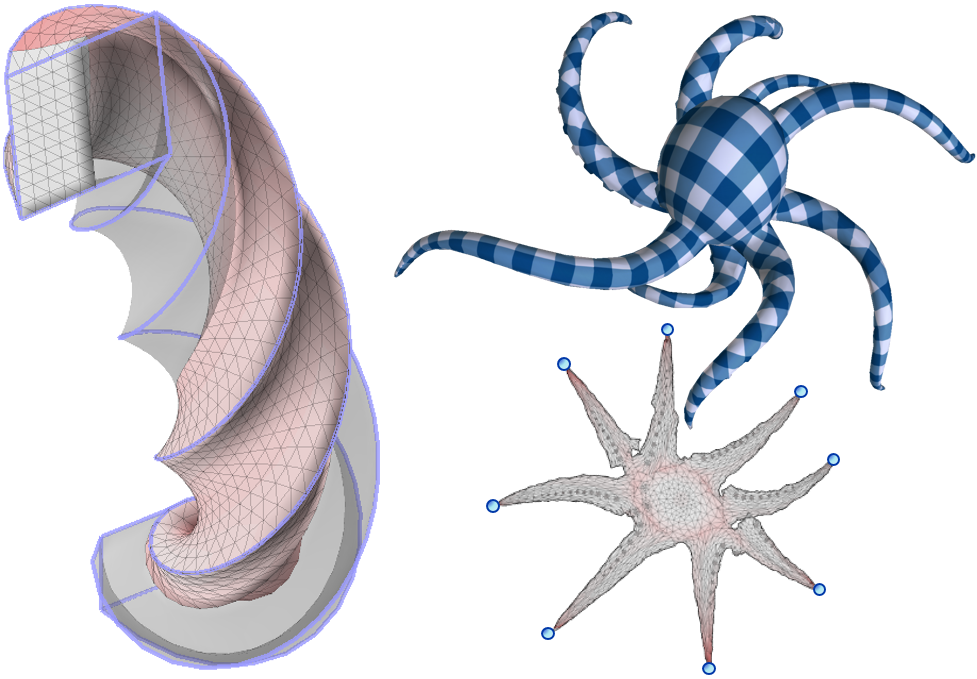

# Adaptive Block Coordinate Descent for Distortion Optimization

An implementation of adaptive block coordinate descent (ABCD) with gradient descent (GD) and projected Newton (PN) core-solvers. The code  contains matlab interface and C++ Mex implementation of block coordinate solvers.

## Getting Started

These instructions will get you a copy of the project up and running on your local machine for development and testing purposes. See deployment for notes on how to deploy the project on a live system.

### Prerequisites

* [Eigen](http://eigen.tuxfamily.org/index.php?title=Main_Page) (default solver)
* [Pardiso](https://www.pardiso-project.org/) (optional)
  - It's recommended to compile pardiso version directly from  Visual Studio on windows platforms. (contact authors for visual studio solution files)
* [libigl](https://libigl.github.io/) (mesh loading)
* [boost](https://www.boost.org/) (graph coloring)

### Installing

To run the solver, all C++ Mex code has to be compiled first. This can be done in Matlab by running the following script:

```
cd mexed_solver/mex
compile_all_mex
```

### Running the Demo

Use the following script to run the demo

```
addpath tests
ABCD_PN_tests
```

Run it  with an example of getting some data out of the system or using it for a little demo.
Tested with Matlab R2018b and Visual Studio 2015.
## Visualization

The matlab interface includes win64 mex files used for reporting results  and visualization. 

To run it on other platforms, either disable the visualization, or contact authors for source code of mexw64 files



## Parallelization

For parallel version add '/openmp' to mex compile flags.

## License

This project is licensed under Mozilla Public License, version 2.0 - see the [LICENSE.md](LICENSE.md) file for details
