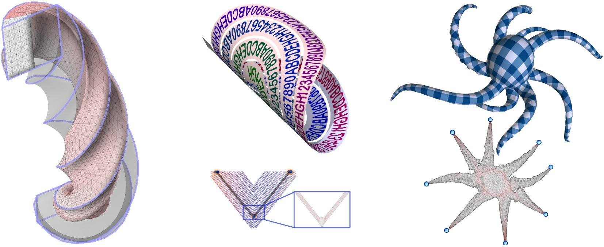

# Adaptive Block Coordinate Descent for Distortion Optimization
Adaptive block coordinate descent (ABCD) is a new algorithm for optimizing geometric distortions and computing  inversion-free maps in 2D and 3D.
This code  has a  Matlab I/O interface and C++ implementation of ABCD algorithm with gradient descent (GD) and projected Newton (PN) solvers. 

[`DOI`](https://onlinelibrary.wiley.com/doi/abs/10.1111/cgf.14043)  [`Paper`](https://alexnaitsat.github.io/html/projects/abcd/abcd_submitted_version.pdf)  [`Video `](https://sgp2020.sites.uu.nl/programme/#optimization)  

## Dependencies

* [Eigen](http://eigen.tuxfamily.org/index.php?title=Main_Page) (default solver)
* [Pardiso](https://www.pardiso-project.org/) (optional)
* [libigl](https://libigl.github.io/) (mesh loading)
* [boost](https://www.boost.org/) (graph coloring)

## Build

We provide  windows binaries  (mexw64) that support Eigen library.
For running ABCD solver on other platforms, all C++ Mex code has to be compiled first. This can be done in Matlab by running the following script:

```
cd mexed_solver/mex
compile_all_mex
```
Follow instructions of ```compile_all_mex.m``` for building ABCD code with [Pardiso](https://www.pardiso-project.org/) 
 * We recommend to compile Pardiso version directly from  Visual Studio on Windows (read [instructions](https://stackoverflow.com/questions/16716821/how-to-build-mex-file-directly-in-visual-studio) or contact authors for project files).

## Running the demo

Run in Matlab command window:

```
ABCD_PN_demo
```

## Data formats
Examples of different input formats are shown in  the demo script
### 2D input
We support obj files (with or without texture)  or  mat files that contain triangles, vertices and initialization (T, V, fV)

* Specify in ``` options.is_uv_mesh``` if it is a surface parametrization or a planar deformation problem 

### 3D input
We support  mat files that contain  tetrahedrons, vertices and initialization (T, V, fV)

### Solver specifications
We set all ABCD parameters at the beginning of the demo script (```optimzier_spec``` and  ```fixer_spec``` structs).
Note that ABCD is a highly customizable solver and  you can reconfigure it  by changing the following fields in a solver spec struct:

```
    energy_num           : distortion energies for optimizer (0,2) and fixer (3)
                         : 0 - ARAP
                         : 2 - symmetric Dirichlet (modified)
                         : 3 - invalid simplex penalty
    invalid_penalty      : cost of flipped and collapsed simplices
    is_flip_barrier      : enable/disable energy barriers
    
    is_parallel          : enable/disable openmp parallelization
    use_pardiso          : enable/disable Pardiso 
    
    ls_interval          : line search interval (fixer interval > 1.0)
    ls_alpha             : backtracking  search parameter
    ls_beta              : backtracking  search parameter
    ls_max_iter          : backtracking  search parameter
    
    block_iteration_range: controls the number of block iterations for inexact BCD
    cycle_num            : number of sucessive iterations in alternating optimization
    tolerance            : termination criteria
                
    K_hat_list           : partitioning thresholds (if not set, then 
    K_hat_size           : local-global blending is disabled)
```

* Additional parameters in ```options``` struct:

  ```
  free_bnd             : set boundary vertices to be free or fixed  
  fixed_vertices       : indices of anchor vertices 
  iter_num             : the maximal number of all iterations 
  ```

  

## Visualization

A simple Matlab code is provided for data visualization. 


## License

This project is licensed under Mozilla Public License, version 2.0 - see the [LICENSE.md](LICENSE.md) file for details
